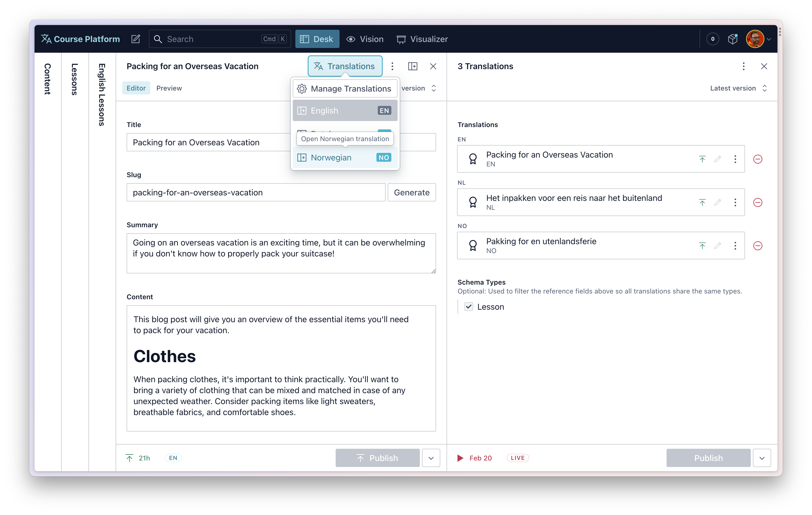

# @sanity/document-internationalization

All new rewrite exclusively for Sanity Studio v3

- [@sanity/document-internationalization](#sanitydocument-internationalization)
  - [What this plugin solves](#what-this-plugin-solves)
    - [Many projects use both](#many-projects-use-both)
  - [Upgrade](#upgrade)
  - [Install](#install)
  - [Usage](#usage)
    - [Basic configuration](#basic-configuration)
    - [Advanced configuration](#advanced-configuration)
    - [Language field](#language-field)
  - [Querying translations](#querying-translations)
    - [Querying with GROQ](#querying-with-groq)
    - [Querying with GraphQL](#querying-with-graphql)
  - [Note on document quotas](#note-on-document-quotas)
  - [Documentation](#documentation)
  - [License](#license)
  - [Develop \& test](#develop--test)
    - [Release new version](#release-new-version)



## What this plugin solves

There are two popular methods of internationalization in Sanity Studio:

- **Document-level translation**
  - A unique document version for every language
  - Joined together by references in a `translation.metadata` document
  - Best for documents that have unique, language-specific fields and no common content across languages
  - Best for translating content using Portable Text
- **Field-level translation**
  - A single document with many languages of content
  - Achieved by mapping over languages on each field
  - Best for documents that have a mix of language-specific and common fields
  - Not recommended for Portable Text

This plugin adds features to the Studio to improve handling **document-level translations**.

- A Language Selector to create and browse language-specific versions of a Document
- Hooks and components to use throughout your custom components to handle translations
- Document Badges to highlight the language version of a document

For **field-level translations** you should use the [sanity-plugin-internationalized-array](https://github.com/sanity-io/sanity-plugin-internationalized-array).

### Many projects use both

An example of **document-level** translation could be a `lesson` schema, the `title`, `slug` and `content` fields would be unique in every language.

A good use of **field-level** translation could be a `person` schema. It could have the same `name` and `image` in every language, but only the `biography` would need translating.

## Upgrade

[See the upgrade guide](./docs/00-upgrade-from-v1.md) for instructions on how to upgrade from the previous version of Document Internationalization.

## Install

```
npm install --save @sanity/document-internationalization
```

## Usage

Add it as a plugin in `sanity.config.ts` (or .js):

### Basic configuration

The only required configuration is:

- The `supportedLanguages` array and
- The `schemaTypes` array

```ts
// sanity.config.ts

import {createConfig} from 'sanity'
import {documentInternationalization} from '@sanity/document-internationalization'

export const createConfig({
  // ... all other config
  plugins: [
    // ... all other plugins
    documentInternationalization({
      // Required configuration
      supportedLanguages: [
        {id: 'es', title: 'Spanish'},
        {id: 'en', title: 'English'}
      ],
      schemaTypes: ['lesson'],
    })
  ]
})
```

### Advanced configuration

The plugin also supports asynchronously retrieving languages from the dataset, modifying the language field, adding a bulk publishing feature and adding additional fields to the metadata document.

```ts
// sanity.config.ts

import {createConfig} from 'sanity'
import {documentInternationalization} from '@sanity/document-internationalization'

export const createConfig({
  // ... all other config
  plugins: [
    // ... all other plugins
    documentInternationalization({
      // Required
      // Either: an array of supported languages...
      supportedLanguages: [
        {id: 'nb', title: 'Norwegian (Bokmål)'},
        {id: 'nn', title: 'Norwegian (Nynorsk)'},
        {id: 'en', title: 'English'}
      ],
      // ...or a function that takes the client and returns a promise of an array of supported languages
      // MUST return an "id" and "title" as strings
      // supportedLanguages: (client) => client.fetch(`*[_type == "language"]{id, title}`),

      // Required
      // Translations UI will only appear on these schema types
      schemaTypes: ['lesson'],

      // Optional
      // Customizes the name of the language field
      languageField: `language` // defauts to "language"

      // Optional
      // Keep translation.metadata references weak
      weakReferences: true // defaults to false

      // Optional
      // Adds UI for publishing all translations at once. Requires access to the Scheduling API
      // https://www.sanity.io/docs/scheduling-api
      bulkPublish: true // defaults to false

      // Optional
      // Adds additional fields to the metadata document
      metadataFields: [
        defineField({ name: 'slug', type: 'slug' })
      ],

      // Optional
      // Define API Version for all queries
      // https://www.sanity.io/docs/api-versioning
      apiVersion: '2023-05-22'
    })
  ]
})
```

### Language field

The schema types that use document internationalization must also have a `string` field type with the same name configured in the `languageField` setting. Unless you want content creators to be able to change the language of a document, you may hide or disable this field since the plugin will handle writing patches to it.

```ts
// ./schema/lesson.ts

// ...all other settings
defineField({
  // should match 'languageField' plugin configuration setting, if customized
  name: 'language',
  type: 'string',
  readOnly: true,
  hidden: true,
})
```

### Excluding fields

The default behaviour of this plugin when creating a new translation is to duplicate the originating document, which is useful for then translating the fields directly in the new document - perhaps with [Sanity AI Assist](https://github.com/sanity-io/assist). However, sometimes you may want to exclude certain fields from being copied to the new document. You can do this by updating your schema to exclude certain types or fields with `options.documentInternationalization.exclude`:

```ts
defineField({
  name: 'title',
  title: 'Title',
  type: 'string',
  options: {
    documentInternationalization: {
      exclude: true,
    },
  },
}),
```

## Querying translations

### Querying with GROQ

To query a single document and all its translations, we use the `references()` function in GROQ.

```json5
// All `lesson` documents of a single language
*[_type == "lesson" && language == $language]{
  title,
  slug,
  language,
  // Get the translations metadata
  // And resolve the `value` reference field in each array item
  "_translations": *[_type == "translation.metadata" && references(^._id)].translations[].value->{
    title,
    slug,
    language
  },
}
```

### Querying with GraphQL

Fortunately, the Sanity GraphQL API contains a similar filter for document references.

```graphql
# In this example we retrieve a lesson by its `slug.current` field value
query GetLesson($language: String!, $slug: String!) {
  allLesson(
    limit: 1
    where: {language: {eq: $language}, slug: {current: {eq: $slug}}}
  ) {
    _id
    title
    language
    slug {
      current
    }
  }
}

# And then can run this query to find translation metadata documents that use its ID
query GetTranslations($id: ID!) {
  allTranslationMetadata(where: {_: {references: $id}}) {
    translations {
      _key
      value {
        title
        slug {
          current
        }
      }
    }
  }
}
```

## Note on document quotas

In previous versions of this plugin, translations were stored as an array of references on the actual documents. This required a base language, lead to messy transaction histories and made deleting documents difficult.

In this version of the plugin, translations of a document are stored as an array of references in a separate document of the type `translation.metadata`, and one is created for every document that has translations. A document with no translations will not have a metadata document.

This means if you have 100 documents and they are all translated into 3 languages, you will have 400 documents. Keep this in mind for extremely high-volume datasets.

## Documentation

For more advanced topics see the documentation. For installation see [Usage](#usage).

- [Upgrade from v1](./docs/00-upgrade-from-v1.md)
- [Creating translations of singleton documents](./docs/01-singleton-documents.md)
- [Importing and creating documents](./docs/02-importing-and-creating-documents.md)
- [Deleting translated documents](./docs/03-deleting-translated-documents.md)
- [Importing plugin components](./docs/04-importing-plugin-components.md)
- [Allowing the same slug on different language versions](./docs/05-allowing-the-same-slug-for-translations.md)
- [Remove default new document template](./docs/06-remove-default-new-document-template.md)

## License

[MIT](LICENSE) © Sanity.io

## Develop & test

This plugin uses [@sanity/plugin-kit](https://github.com/sanity-io/plugin-kit)
with default configuration for build & watch scripts.

See [Testing a plugin in Sanity Studio](https://github.com/sanity-io/plugin-kit#testing-a-plugin-in-sanity-studio)
on how to run this plugin with hot reload in the studio.

### Release new version

Run ["CI & Release" workflow](https://github.com/sanity-io/sanity-plugin-workflow/actions/workflows/main.yml).
Make sure to select the main branch and check "Release new version".

Semantic release will only release on configured branches, so it is safe to run the release on any branch.
