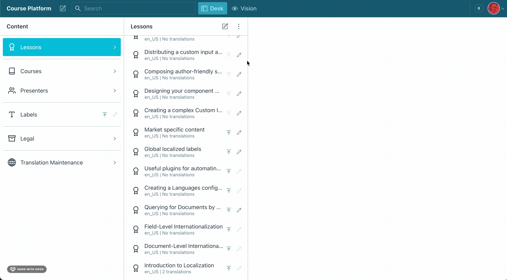

# Document Internationalization Plugin for Sanity.io

> This is a **Sanity Studio v3** plugin.
> For the v2 version, please refer to the [v2-branch](https://github.com/sanity-io/document-internationalization/tree/studio-v2).

[](https://www.npmjs.com/package/@sanity/document-internationalization)



## What this plugin solves

There are two popular methods of internationalization in Sanity Studio:

- **Document-level translation**
  - A unique document version for every language
  - Joined together by references and/or a predictable `_id`
  - Best for documents that have unique, language-specific fields and no common content across languages
  - Best for translating content using Portable Text
- **Field-level translation**
  - A single document with many languages of content
  - Achieved by mapping over languages on each field, to create an object
  - Best for documents that have a mix of language-specific and common fields
  - Not recommended for Portable Text

This plugin adds features to the Studio to improve handling **document-level translations**.

- A Language Selector to create and browse language-specific versions of each Document
- Document Actions to update base and translated documents to ensure references stay in tact
- Document Badges to highlight the language version of a document

For **field-level translations** you should use the [@sanity/language-filter plugin](https://www.npmjs.com/package/@sanity/language-filter).

*Studio V3 note*: language-filter is not available for V3 yet.

### Many projects use both!

*Studio V3 note*: language-filter is not available for V3 yet.

An example of document-level translation could be a `lesson` schema, the `title`, `slug` and `content` fields would be unique in every language.

A good use of field-level translation could be a `person` schema. It could have the same `name` and `image` in every language, but only the `biography` would need translating.

## Studio V3 known issues

Studio V3 does not implement language-filter yet. This means that the language button has moved into the document editor flow for the time being.
We will be looking to restore the button placement during Studio V3 dev-preview. 

## Installation

From the same directory as the Studio run:

```sh
npm install --save @sanity/document-internationalization
```

or

```sh
yarn add @sanity/document-internationalization
```


The plugin is now installed, but you will need to complete the following steps to see the Document Translation UI:

## Setup next steps
1. [Enabling and configuring the plugin](docs/enabling-and-configuring.md)  
   To declare available Languages and other settings
2. [Activating internationalization on schema](docs/activating-internationalization-on-schema.md)  
   To enable all the above features on schema
3. [Customise Desk Structure](docs/desk-structure.md)  
   To filter documents down to the base language version

## Other documentation

1. [Known Caveats](docs/known-caveats.md)
2. [Data structure](docs/datastructure-intl-doc.md)
3. [Translation Maintenance](docs/translation-maintenance.md)
4. [GraphQL support](docs/graphql-intl-doc.md)
5. [Advanced languages](docs/advanced-languages.md)
6. [Usage with custom publish action](docs/usage-with-custom-publish.md)
7. [If you don't see the plugin document actions](docs/usage-with-custom-publish.md#add-additional-actions)
8. [GROQ query examples](/docs/groq-query-examples.md)

## Migrating from sanity-plugin-intl-input

While most of the UI is the same in the official version of this plugin there are some breaking changes you should be aware of before migrating:

[Coming from sanity-plugin-intl-input](docs/coming-from-sanity-plugin-intl-input.md)


## License

MIT-licensed. See LICENSE.

## Develop & test

This plugin uses [@sanity/plugin-kit](https://github.com/sanity-io/plugin-kit)
with default configuration for build & watch scripts.

See [Testing a plugin in Sanity Studio](https://github.com/sanity-io/plugin-kit#testing-a-plugin-in-sanity-studio)
on how to run this plugin with hotreload in the studio.

### Release new version

Run ["CI & Release" workflow](https://github.com/sanity-io/document-internationalization/actions/workflows/main.yml).
Make sure to select the main branch and check "Release new version".

Semantic release will only release on configured branches, so it is safe to run release on any branch.
