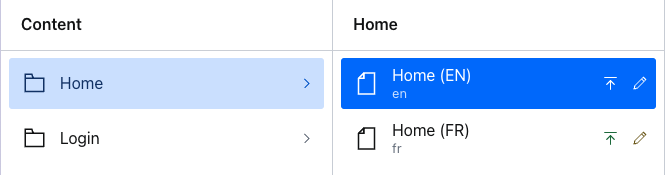

# Creating translations of singleton documents



Singleton documents in Sanity are usually created with the [Structure Builder](https://www.sanity.io/docs/structure-builder-reference) by creating a `S.documentListItem()` with a predetermined ID.

This isn't enough when it comes to translated documents as you need to create an ID for each document and bind them together with a translations metadata document.

For translated singletons you will need to:

1. Run a script to create the documents in advance
2. Update your Desk Structure to use a list of documents that know these created IDs

## 1. Create the documents

Instructions for how to perform this migration are written in the script itself: [https://github.com/sanity-io/document-internationalization/blob/main/scripts/createSingletons.ts](https://github.com/sanity-io/document-internationalization/blob/main/scripts/createSingletons.ts)

This script will create a document for each singleton you need, and a translations document that will be used to bind them together.

If you add more languages later you may need to adapt this script to check first for the existence of the translations metadata document and append the new translations to it.

## 2. Update your Desk Structure

At this time it's not possible to re-use the `supportedLanguages` array passed into the plugin configuration for this step, so this will not work for languages called from an async function.

In the example below, we re-use the same arrays of SINGLETONS and LANGUAGES as the creation script to render a new list for every "singleton" and a new item inside it for every "language" version.

This will render list items as shown in the screenshot above.

```ts
const SINGLETONS = [
  {id: 'home', _type: 'page', title: 'Home'},
  {id: 'login', _type: 'page', title: 'Login'},
]
const LANGUAGES = [
  {id: `en`, title: `English`},
  {id: `fr`, title: `French`},
]

export const structure: StructureResolver = (S) =>
  S.list()
    .title('Content')
    .items([
      ...SINGLETONS.map((singleton) =>
        S.listItem()
          .title(singleton.title)
          .id(singleton.id)
          .child(
            S.list()
              .title(singleton.title)
              .id(singleton.id)
              .items(
                LANGUAGES.map((language) =>
                  S.documentListItem()
                    .schemaType(`page`)
                    .id(`${singleton.id}-${language.id}`)
                    .title(`${singleton.title} (${language.id.toLocaleUpperCase()})`)
                )
              )
              .canHandleIntent(
                (intentName, params) => intentName === 'edit' && params.id.startsWith(singleton.id)
              )
          )
      ),
      // ...other list items
```
