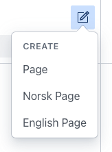
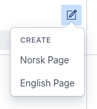

# Remove default new document template

This plugin creates new [Parameterized initial value templates](https://www.sanity.io/docs/initial-value-templates#66d873e2136f) so that any schema types configured in the plugin can be started with a language field already set.

However, it does not remove the default new document template which would start a document with no language field value. So your "new document" menus might look like this:



To remove the default new document option, update your Sanity Studio configuration like below, where `prev` represents all previously registered templates in the Studio, and we filter out some defaults based on schema type and ID.

```ts
// ./sanity.config.ts

export default defineConfig({
  //...rest of config
  schema: {
    // ...rest of schema

    // Filter out the default template for new "page" and "lesson" type documents
    templates: (prev) =>
      prev.filter((template) => !['page', 'lesson'].includes(template.id)),
  },
})
```

Now your new document menu for just this type will look like this


