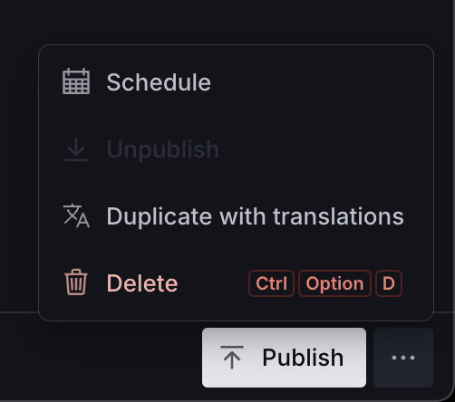

# Duplicating translated documents

This plugin includes a custom document action that will duplicate a localized document, its translations, and the metadata document that relates them.



Import the document action and configure which document types will use it:

```ts
import {
  documentInternationalization,
  DuplicateWithTranslationsAction,
} from '@sanity/document-internationalization'

export default defineConfig({
  // ...all other config
  document: {
    actions(prev, {schemaType}) {
      // these will be the schema types you're passing to the plugin configuration
      return schemaTypes.includes(schemaType)
        ? prev.map((action) =>
            action.action === 'duplicate'
              ? DuplicateWithTranslationsAction
              : action
          )
        : prev
    },
  },
})
```
