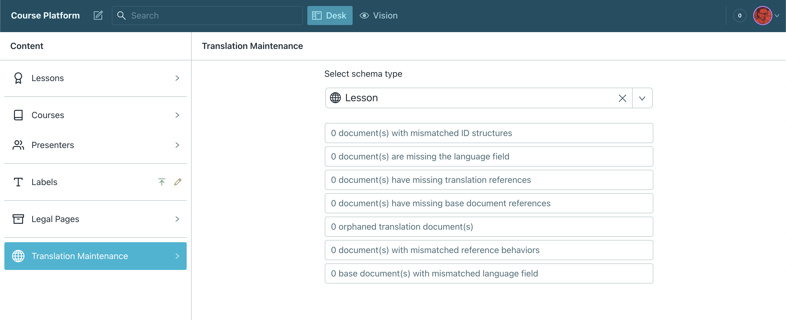

# Translation maintenance

## :warning: This is an advanced feature as it will affect your dataset. Make sure you know what you are doing when using it.



The translation maintenance tab can be used to clean up and manage your Sanity data. This feature is disabled by default but can be enabled in the `document-internalization.json` file by setting the `withTranslationsMaintenance` key to `true`
```json
{
  "withTranslationsMaintenance": true
}
```

When enabled, it can help you out when you need to adjust data in bulk after changing the i18n configuration or simply when something went wrong. It can help with the following operations:

1. Migrating between different `_id` structures
2. Fix documents who are missing the language field
3. Fix documents who are missing references to their translations
4. Fix documents who are missing the base document reference
5. Clean up orphaned translations who are missing their base document