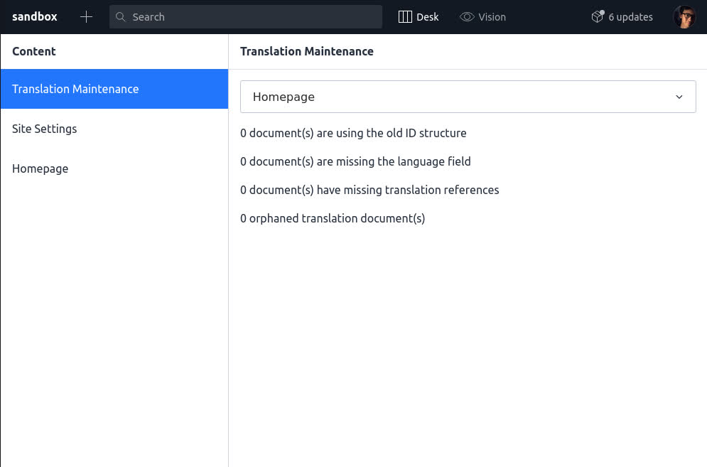

# Translation Maintenance

The translation maintenance tab can be used to clean up and manage your Sanity data. It can help with the following operations:
1. Migrating between different ID structures
2. Fix documents who are missing the language field
3. Fix documents who are missing references to their translations
4. Fix documents who are missing the base document reference
5. Clean up orphaned translations who are missing their base document